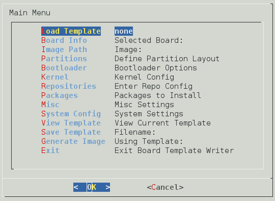

RootFS Build Factory
====================
Being developed for Google Summer Of Code 2015
----------------------------------------------
*Organization: CentOS*

*Written By: Mandar Joshi [emailmandar at gmail.com]*

*Mentor: Ian McLeod [imcleod at redhat.com]*

- This project is still in the development stage. I've tested it with Fedora 22 ARM (Dnf), Fedora 21 ARM and CentOS 7 ARM repositories.
- Default **root** password has now been set to **password1234** in all templates.

**Tested Emulators**
- Qemu [HowTo](doc/QEMU_README.md)

**Tested Boards**
- Cubietruck
- Odroid C1
- Raspberry Pi 2
- Banana Pi (Tested By Nicolas [nicolas at shivaserv.fr])
- Cubieboard 2 (Tested by David Tischler [david.tischler at mininodes.com]
 
**Untested Boards**
- Cubieboard
- Wandboard{solo,dual,quad}
- Pandaboard
- CompuLab TrimSlice
- Beaglebone

**Unsupported Boards**
- Refer [this](doc/ADD_SUPPORT_README.md) document to learn how to add support for more boards.

If you have any of the untested boards, please test the RootFS Build Factory and let us know the results. You can email me [emailmandar at gmail.com] or discuss it on the CentOS arm-dev mailing list http://lists.centos.org/mailman/listinfo/arm-dev

**Note:**
- You need to be root to use RootFS Build Factory
- One of the initial checks rbf.py makes is if you have the required programs to generate images. 'expect' is now required to set the root password. Install it using
        
        yum install expect
        
- If you want to use rbfdialog.py, 'dialog' is required as a dependency of python2-pythondialog (gsoc2015 repo). Install it using

        yum install dialog
        yum install python2-pythondialog
        
- My test setup is Fedora 21 ARM and CentOS 7 ARM on Cubietruck.
- root password has been set to password1234 in all templates.
- You need to install *dosfstools* if you want to create vfat partitions.
- the etc overlay directory (default ./etc) is not cleared before every run. It allows you to copy any config files to the new installroot. So files present in the etc overlay directory will be copied to the new installroot's /etc.

**Usage of rbf.py:**
- Edit template/cubietruck.xml and set image path in the image tag

- Set repository information as per your distro. templates/cubietruck.xml and templates/rpi2.xml are bare minimum ones.
  You can even specify a local repository if you have one. The provided info is used as baseurl.

- To just parse the XML Template

        ./rbf.py parse templates/cubietruck.xml

- To Also build image.

        ./rbf.py build templates/cubietruck.xml

- Follow the output of the script. 
  Presently it prompts you to press Enter after every step.
  The script uses the yum command to install packages. The yum command asks you whether to continue with y/d/N after resolving dependencies.

- Once the image is generated write it your microsd card using dd or dcfldd

        dcfldd if=cubietruck-centos-image.img of=/dev/sdb 

- Just login as root. No password is required. 
  The default config of u-boot is set as console=ttyS0,115200
  If you want to see the boot messages you will need a USB to TTL Cable.
  The provided u-boot for cubietruck supports HDMI console. However USB Keyboard gives some problems.
    
- With the Cubietruck,Raspberry Pi and Odroid C1, once booted you will get the login prompt on HDMI tty0.

- You can experiment with different templates. You can use custom built kernels too. See templates/odroidc1.xml
  
- The *group* and *package* tags in the *packages* element take comma separated package names as well.

**Usage of rbfdialog.py**
- It uses the python2-pythondialog-3.3 library. You can get the rpm from the rpms directory or install it from source from http://pythondialog.sourceforge.net/. As dependency it needs *dialog* installed. So do this first

        yum install dialog
        
- The main menu looks like this

- There are quite a few options to set. So the best way to use it is to load a working template first and then edit the options as per your requirement.

- Go to *View Template* to verify that all the options have been set.

- The do *Save Template* to save the XML template to a location of your choice.

- Then run

        ./rbf.py build /path/to/template.xml

- The dialog based UI uses *space* completion instead of *tab* completion. It takes some time to get used to.

**Known Issues:**

- This happens with the Cubietruck at times. It has happened to me twice after plugging in the HDMI cable.
  It boots from NAND flash instead of the microsd card. Just rebooting by pressing the button on the side fixes the problem for me.
  
- On one of my micrSD cards, one issue I have faced on the Cubietruck is resetting of CPU while loading the dtb. Here are the messages from the serial console http://pastebin.com/x6gELrjW

- On Raspberry Pi 2, firewalld doesn't start correctly. This is caused by  *IPv6_rpfilter=yes* in */etc/firewalld/firewalld.conf*. Firewalld gives this error http://pastebin.com/FwHgvyXw in */var/log/firewalld* while starting.
Setting *IPv6_rpfilter=no* in /etc/firewalld/firewalld.conf fixes the problem for me.
    
**Usage of scripts in commonscripts:**

- expandimage.sh $FILE $EXPANDBY
    Expands $FILE by $EXPANDBY. Uses fallocate to expand the provided file
    
        commonscripts/expandimage.sh disk.img 4096M

- loopdevcreate.sh $FILE $LOOPDEVICE
    Creates a loop back device for provide partition. Can be use to create /dev/loop* for partition from raw disk image.
    
        commonscripts/loopdevcreate.sh disk.img /dev/loop0
    To Detach, use losetup -d
    
        losetup -d /dev/loop0
    
- mountpart.sh $FILE $PARTITION $MOUNTPOINT
    Mounts specified partition from disk image to mount point.
    
        commonscripts/mountpart.sh disk.img 1 /media/pendrive/
    
- writeimage.sh $FILE $DEVICE
    Informs user which device will be written to (displays vendor and model) before executing the dd command
    
        commonscripts/writeimage.sh centos.img /dev/sdd

**Usage of yumplugins/extlinuxconf.py:**

This plugin appends entries to /boot/extlinux/extlinux.conf everytime kernel-core is installed or updated.
Thus making your new kernel bootable.

- Copy yumplugins/extlinuxconf.py to /usr/lib/yum-plugins/
  and  yumplugins/extlinuxconf.conf to /etc/yum/pluginconf.d/
  
        cp yumplugins/extlinuxconf.py /usr/lib/yum-plugins/
        cp yumplugins/extlinuxconf.conf /etc/yum/pluginconf.d/
    

**About contents of the directory 'files':**
- The files in the directory files/rpi2 have been taken from https://github.com/raspberrypi/firmware.git. config.txt and cmdlinux.txt from F21

- files/{cubietruck,bananapi,cubieboard,cubieboard2,beaglebone,pandaboard} have been cross compiled from the u-boot git repo git://git.denx.de/u-boot.git

- The kernel files/odroidc1 have been taken from Ubuntu 14.04. The u-boot files have been compiled from sources at https://github.com/hardkernel/u-boot.git

- The rpms directory has RPMs generated from sources available here http://pythondialog.sourceforge.net/

- files/wandboard* have been taken from http://wiki.wandboard.org/index.php/Sdcard-images

