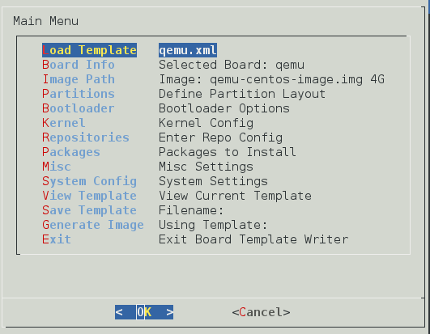
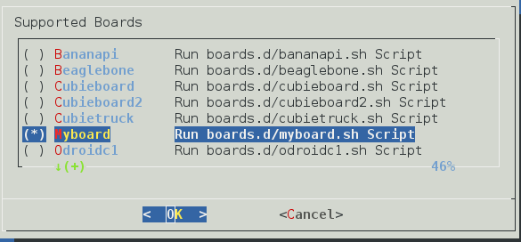
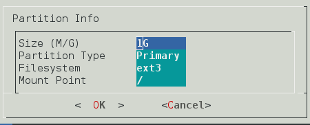
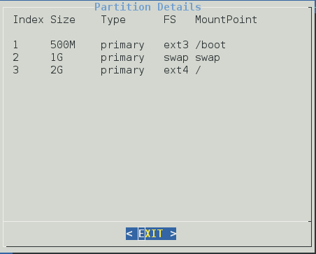
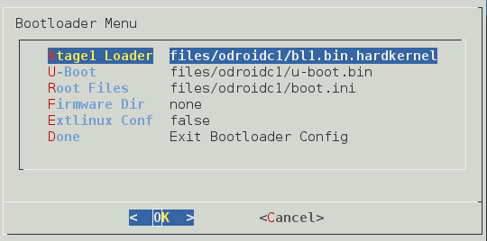
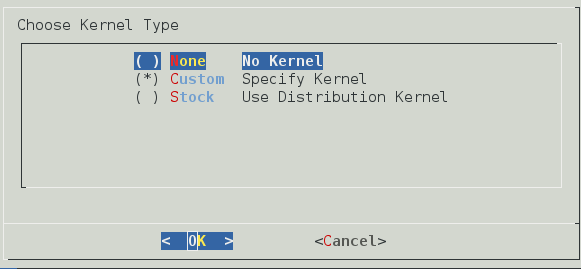
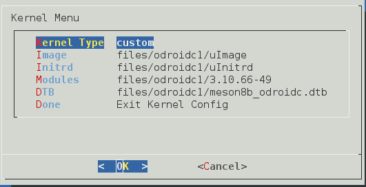
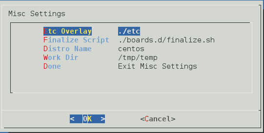
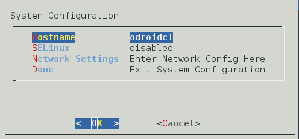
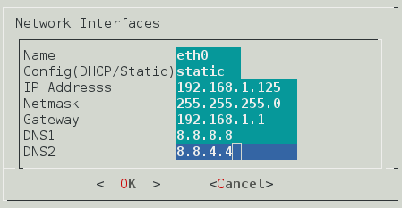

RootFS Build Factory
====================
Adding support for more boards
-------------------------------
For each board you need
- Board Script
- XML Template
- Kernel, Modules, Initramfs & dtb

Creating the Board Script
-------------------------
- The QEMU board script is the simplest one. So, just make a copy of it. Make sure it executable.
- The name of the board script should be ***[boardname].sh***

        cd boards.d
        cp qemu.sh myboard.sh
        chmod +x myboard.sh
        
- Refer [this](BOARD_SCRIPTS_README.md) document to learn how to write a board script.

Creating the XML Template
--------------------------
- Refer the main [README](../README.md) first to learn about the library dependencies.

- Launch **rbfdialog.py**. There are quite a few options to set, so the best way to use it is to load a working template and then edit options as per your requirement. Let's load the QEMU template using the ***Load Template*** menu option. Once loaded, this is what the main menu will look like. 

- Next, select your board under ***Board Info***. The new board script you created will be listed as "Myboard". Press [space] to select it and [Enter] to return to the main menu. ***Board Info*** will now say *Selected Board: myboard*.

- ***Image Path*** allows you to select the location of your generated image and its size. It first asks you to select the directory to store the image in and then the image size. This size should be an integer with a suffix 'M' for MB and 'G' for GB.

- ***Partitions*** allows you to add and delete partitions. Standard MBR partitioning rules apply.

 

- ***Bootloader Options***. Let's look at the first three, *Stage1 Loader*, *U-Boot* & *Root Files*. The value of these options are available in the board script. Refer your board manufacturer's documentation to know which *Stage1 Loader* and *U-Boot* to use. To learn how to use *Root Files* refer the board scripts README. *Firmware Dir* lets you specify the firmware to copy to the new rootfs. The contents of the specified directory are copied to */lib/firmware/*. If *Extlinux Conf* is set to *true*, /boot/extlinux/extlinux.conf is created in the new rootfs to point to your kernel. A fully configured *Bootloader Menu* for the Odroid C1 looks like this. Between the *Cubietruck*, *Raspberry Pi 2* and *Odroid C1*, all the options are covered. Load each of the templates to learn about these settings.

- ***Kernel*** menu. If you know that the stock kernel supports you board, set kernel type as *Stock*. Setting it to *Custom* allows you to specify the kernel, initrd, kernel modules & dtb. dtb can be a directory or a file and depends on your boot configuration. You can select *None* here if you are handling the kernel completely using the board script.

 

- ***Repositories*** menu allows you to enter the repositories for your distribution. Presently all you are required to enter is the *name* and *BaseURL*.

- ***Packages*** menu allows you to specify a comma separated list of package groups and packages to install.

- ***Misc Settings*** 
    - ***Etc Overlay***: This directory is used to create and then copy over config files like *fstab*,*hostname* and *network settings*. If you have config files that need to be copied over to the new rootfs in the etc directory, place them in this directory. The directory is copied over using the "cp -rpv" command and overwrites existing files. Also, this directory is not cleared before each RootFS Build Factory run. So any files present in the etc overlay when RBF was started will be copied over to the new rootfs.
    - ***Finalize Script***: This script is run for all boards after the board script. Presently it does nothing.
    - ***Distro Name***: The name of the distribution whose repositories you are using. Can be anything you want. Presently it used only as a label in the Extlinuxconf.
    - ***Work Dir***: This is the mountpoint where the new rootfs will be mounted during installation.
    

- ***System Configuration***
    - ***Hostname***: Hostname for your new rootfs. Written to */etc/hostname*.
    - ***SELinux***: *Disabled*, *Permissive* or *Enforcing*.
    - ***Root Password***: Sets root password for new rootfs
    - ***Root SSH Public Key***: Key to copy to /root/.ssh/authorized_keys in the new rootfs
    - ***Network Settings***: Network config for your interfaces.

 

- ***View Template***: Shows the XML Template exactly as it will be written to file.
- ***Save Template***: Save the template to a location of your choice. First asks you the directory where you want to store the new template and then name of the xml file.
- ***Generate Image***: Displays the command you need to execute to generate the rootfs image.

